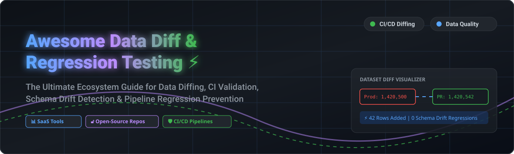

# 📊 Awesome Data Diff & Regression Testing ⚡

  

  
  
  
  
  
  

## 🚀 Top Data Diff & Regression Testing Platforms Ecosystem

**Curated List of SaaS Products & Open-Source GitHub Projects**

*Focused on Data Diffing, Regression Detection, CI/CD Pipeline Validation, Schema & Value Comparison, and Data Quality Risk Prevention.*

**Last updated: October 2026**

---

### 💡 Overview & SEO Summary
This repository tracks leading **SaaS platforms** and **open-source projects** designed for **Data Diffing & Regression Testing**. These solutions allow data engineers, analytics engineers, and data platform teams to compare datasets seamlessly across staging and production environments, detect schema drift or distribution anomalies, and automatically validate data transformation pipelines in CI/CD before merging pull requests.

---

## 📑 Table of Contents
- [🏢 SaaS/Hosted Platforms](#-saashosted-platforms)
- [🔓 Open-Source GitHub Projects](#-open-source-github-projects)
- [💡 Usage Patterns & Architecture](#-usage-patterns--architecture)
- [🤝 How to Contribute](#-how-to-contribute)
- [💖 Support & Sponsorship](#-support--sponsorship)
- [📈 Star History](#-star-history)
- [⚠️ Disclaimer](#%EF%B8%8F-disclaimer)

---

## 🏢 SaaS/Hosted Platforms

> **Market Analysis & Size**: The global Data Observability, Data Quality, and Regression Testing market is estimated at **$2.5B - $3.8B (2026)** with a 22%+ CAGR. The sector is **moderately fragmented**—while market leaders like Monte Carlo and Datafold command significant mindshare in enterprise data stacks, emerging specialized platforms continue to innovate rapidly around AI data verification and continuous CI/CD diffing.

### 📊 Commercial Platforms Matrix

| Platform | Market Size / Company Size (Est. Valuation / Funding / Revenue) | Specific Starting Pricing | Free Tier / Trial Limits | Key Features & Focus |
| :--- | :--- | :--- | :--- | :--- |
| **[Monte Carlo](https://www.montecarlodata.com/)** | **~$1.6B Valuation** ($236M+ Raised, Series D) | Starts at **$15,000 / year** (Custom Enterprise Tiers) | **14-day Free Trial** (Full enterprise feature access & warehouse connection) | Enterprise data observability detecting freshness, volume, schema drift, and data distribution regressions. |
| **[Acceldata](https://www.acceldata.io/)** | **~$600M - $800M Valuation** ($100M+ Raised) | Starts at **$1,000 / month** ($12,000/yr base commitment) | **30-day Free Trial** (Includes data observability & quality checks) | End-to-end enterprise data observability, compute cost optimization, and data reliability monitoring. |
| **[Anomalo](https://www.anomalo.com/)** | **~$500M Valuation** ($72M+ Raised, Series B) | Starts at **$20,000 / year** base subscription | **14-day Free Trial** (Includes automated ML-driven table anomaly detection) | Unsupervised automated data quality and anomaly detection platform for continuous regression monitoring. |
| **[Great Expectations Cloud](https://greatexpectations.io/)** | **~$400M Valuation** ($65M+ Raised, Superconductive) | Starts at **$250 / month** (Pro Tier) | **Free Forever Tier** (1 workspace, up to 10 Data Docs runs/month & 5 expectations suites) | Commercial hosted cloud for managing Great Expectations suites, collaborative results, and CI validation. |
| **[Datafold](https://www.datafold.com/)** | **~$250M - $300M Valuation** ($22M+ Raised) | Starts at **$100 / developer / month** (Team Plan) | **14-day Free Trial** (Unlimited row-level data diffing and dbt CI integration) | Premier data-diff and CI validation engine for dataset comparison and pull request regression checks. |
| **[Bigeye](https://www.bigeye.com/)** | **~$200M - $250M Valuation** ($65M+ Raised) | Starts at **$1,500 / month** base platform | **14-day Free Trial** (Up to 5 data warehouse source connections) | Automated column-level data quality monitoring, metric regression alerts, and delta tracking. |
| **[Soda Cloud](https://www.soda.io/)** | **~$100M - $150M Valuation** ($18M+ Raised) | Starts at **$300 / month** (Soda Cloud Team) | **Free Forever Tier** (1 user, up to 3 datasets monitored & 50 check runs/month) | Centralized data quality contract management dashboard, alerting, and SodaCL check reporting. |
| **[Metaplane](https://www.metaplane.dev/)** | **~$80M - $120M Valuation** ($13.8M+ Raised) | Starts at **$480 / month** (Team Plan) | **Free Forever Tier** (Up to 10 tables monitored, 2 warehouse connections) | Warehouse-centric data observability for instant detection of unexpected metric changes and schema drift. |
| **[Elementary Cloud](https://www.elementary-data.com/)** | **~$50M - $80M Valuation** ($12M+ Raised) | Starts at **$250 / month** (Growth Plan) | **30-day Free Trial** (Full dbt testing dashboard, lineage analysis, and alert integrations) | dbt-native observability cloud providing test performance UI, dataset lineage diffing, and anomaly tracking. |
| **[Qualdo](https://www.qualdo.ai/)** | **~$10M - $20M Valuation** (Early Stage / Seed) | Starts at **$99 / month** (Starter Tier) | **14-day Free Trial** (Includes up to 5 data source monitoring channels) | Machine learning-driven data quality monitoring and anomaly/regression detection for modern data stacks. |

---

## 🔓 Open-Source GitHub Projects

Below are top-tier open-source libraries and frameworks for building self-hosted data diffing, schema assertion, and pipeline regression testing suites.

| Rank | Project & Repository | Stars_Count | Key Capabilities & CI/CD Use Cases |
| :---: | :--- | :---: | :--- |
| 1 | **[dbt Core](https://github.com/dbt-labs/dbt-core)**  | ⭐ **13,948** | Data transformation engine featuring native unit testing, custom SQL assertions, uniqueness/relationship checks, and dbt-expectations package ecosystem. |
| 2 | **[Great Expectations](https://github.com/great-expectations/great_expectations)**  | ⭐ **11,851** | Leading python data validation framework—define expressive expectation suites, automatically profile data, and run quality gates in CI/CD. |
| 3 | **[Pipedream](https://github.com/pipedreamhq/pipedream)**  | ⭐ **11,719** | Integration platform and workflow engine for orchestrating continuous data diff notifications, test webhooks, and regression alerts across systems. |
| 4 | **[Cleanlab](https://github.com/cleanlab/cleanlab)**  | ⭐ **11,683** | Open-source data-centric AI library for automatically detecting label noise, dataset corruption, and tabular data quality regressions in ML pipelines. |
| 5 | **[Evidently](https://github.com/evidentlyai/evidently)**  | ⭐ **7,949** | Open-source ML and data evaluation framework to evaluate, test, and monitor data drift, model performance, and feature distribution regressions. |
| 6 | **[Pandera](https://github.com/unionai-oss/pandera)**  | ⭐ **4,471** | Light-weight, expressive data validation library for Pandas, Polars, PySpark, and Dask dataframes with strict schema enforcement. |
| 7 | **[Deepchecks](https://github.com/deepchecks/deepchecks)**  | ⭐ **4,061** | Continuous validation library for testing data integrity, schema changes, and model performance regressions with minimal boilerplate. |
| 8 | **[Deequ](https://github.com/awslabs/deequ)**  | ⭐ **3,648** | AWS-developed Spark library for calculating data quality metrics and verifying unit-test constraints on large scale datasets. |
| 9 | **[data-diff](https://github.com/datafold/data-diff)**  | ⭐ **2,992** | High-performance CLI tool and Python library for efficiently comparing row-level dataset differences across SQL databases and data warehouses. |
| 10 | **[OpenLineage](https://github.com/OpenLineage/OpenLineage)**  | ⭐ **2,684** | Open standard for metadata and lineage collection, allowing data teams to trace upstream pipeline changes to downstream regression impacts. |
| 11 | **[Soda Core](https://github.com/sodadata/soda-core)**  | ⭐ **2,430** | Open-source CLI & Python engine running YAML-based SodaCL checks for data contract enforcement and automated regression testing. |
| 12 | **[Elementary](https://github.com/elementary-data/elementary)**  | ⭐ **2,415** | Open-source dbt-native observability framework for monitoring model health, anomalous rows, and dbt test execution history. |
| 13 | **[re_data](https://github.com/re-data/re-data)**  | ⭐ **1,572** | Open-source data quality framework for dbt and Python; generates data metrics, alerts, and visual diff reports for warehouse tables. |
| 14 | **[DataComPy](https://github.com/capitalone/datacompy)**  | ⭐ **659** | Capital One's Python library for comparing two Pandas or Spark DataFrames and printing detailed row-by-row and column discrepancy summaries. |
| 15 | **[DBX by Databricks](https://github.com/databrickslabs/dbx)**  | ⭐ **465** | Databricks CLI extension designed to automate staging-to-production data job deployment, integration testing, and regression suites. |

---

## 💡 Usage Patterns & Architecture

### 🛠️ Shift-Left CI/CD Data Testing Blueprint
1. **Row-Level Diffing**: Run `data-diff` or `datacompy` in GitHub Actions on pull requests comparing `PR_development_schema` vs `Production_schema`.
2. **Contract Assertions**: Execute `Great Expectations` or `Soda Core` checks in CI build steps to block merges on schema drift or broken non-null constraints.
3. **dbt Regression Gates**: Utilize `dbt test` alongside `Elementary` packages to monitor dbt model execution state, execution timings, and data freshness anomalies.
4. **Production Observability**: Monitor live production warehouses using platforms like `Monte Carlo`, `Datafold`, or `Metaplane` for runtime anomaly detection.

---

## 🤝 How to Contribute

We welcome community contributions! To add a new platform or open-source tool:
1. Fork this repository. 🍴
2. Create a new branch (`git checkout -b feature/add-tool`).
3. Add entries to `README.md` following the exact table structure.
4. Open a Pull Request with a brief explanation of the tool.

---

## 💖 Support & Sponsorship

If you find this curated list valuable for your analytics engineering workflows or data platform decisions, please consider showing your support:

- 🌟 **Star this repository** on GitHub to help others discover it!
- 🔀 **Fork & Share** it with your team and data engineering community.
- ☕ **Sponsor the Maintainer**: Support ongoing open-source maintenance via [GitHub Sponsors](https://github.com/sponsors/ishandutta2007).

---

## 📈 Star History

---

## ⚠️ Disclaimer

- This is a **community-curated** repository provided for informational purposes.
- Product valuations, pricing tiers, and Stars_Counts are regularly updated but subject to change by respective vendor organizations.
- Always perform your own benchmark testing and security audits before integrating third-party tools into production data stacks.

---

  <b>Made with ❤️ for Analytics Engineers, Data Engineers & Data Quality Advocates worldwide.</b>

